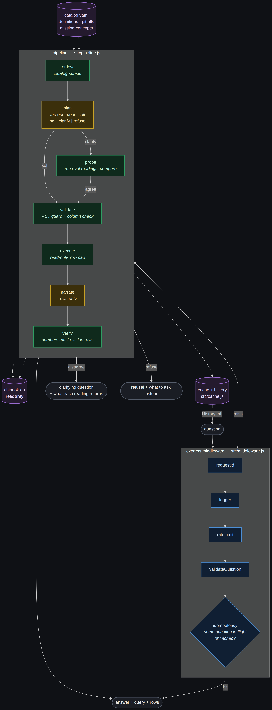
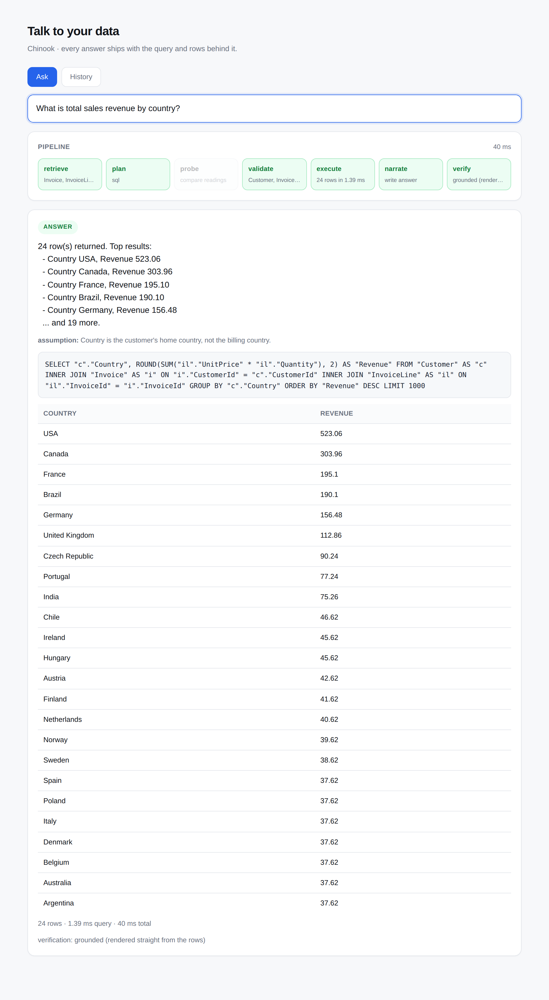
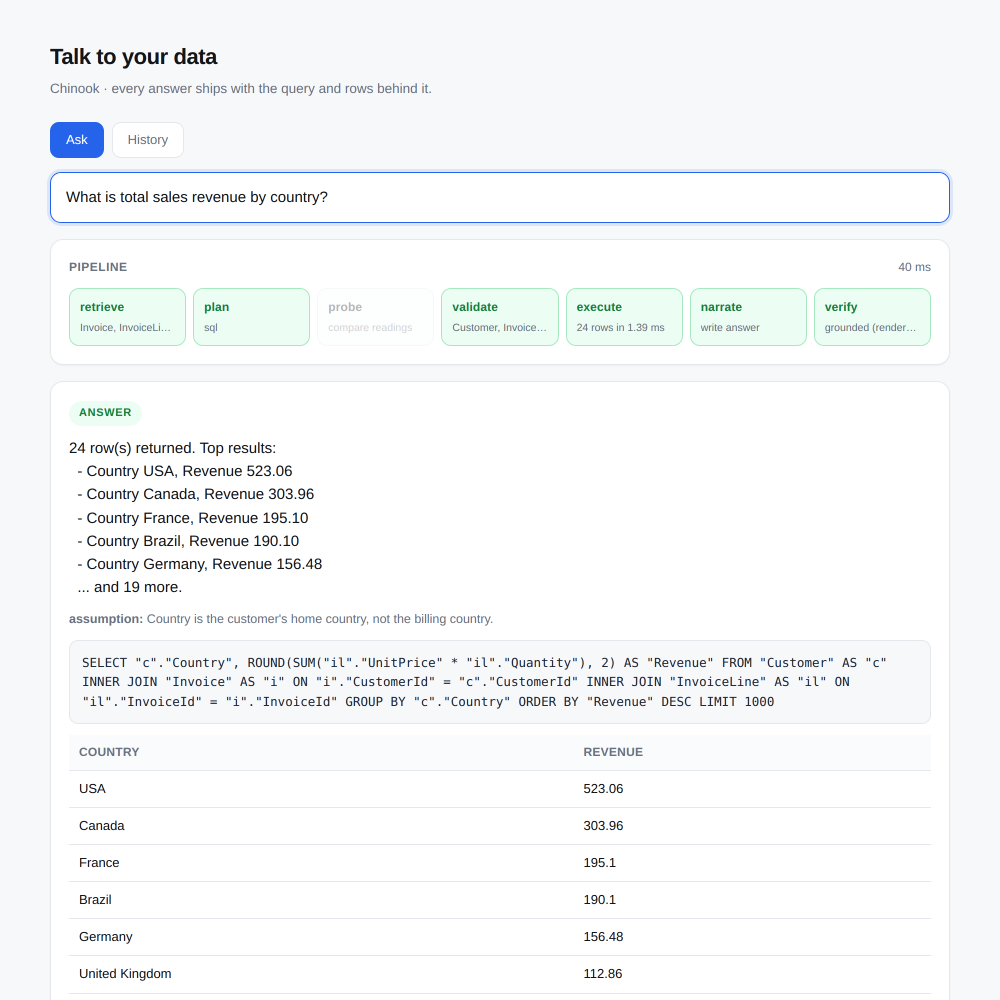
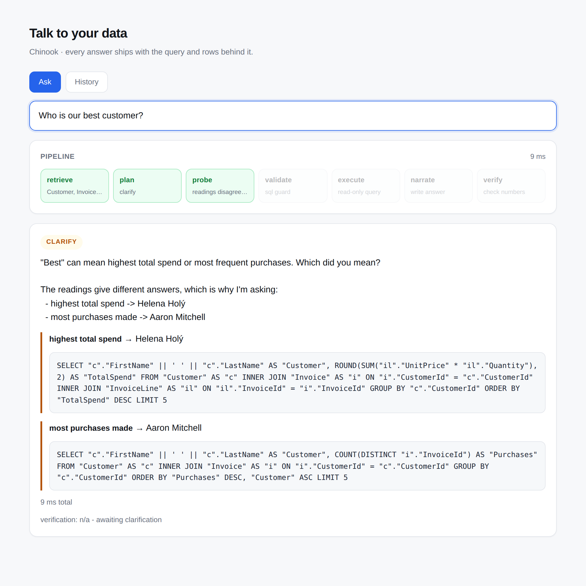
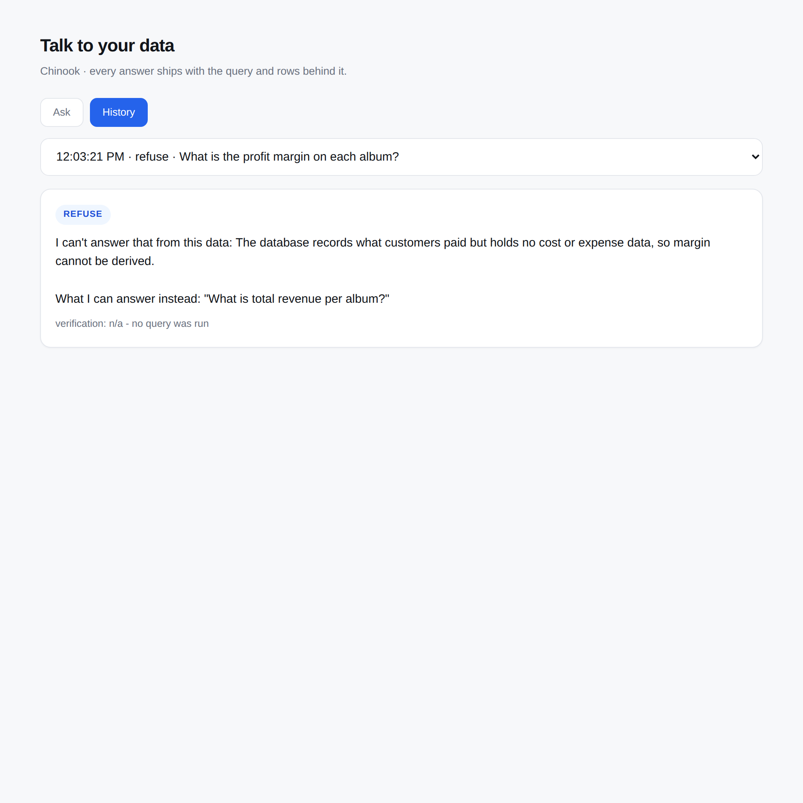

# Talk to your data

Ask questions about the Chinook music store in plain English. Get an answer that
comes with the query that produced it and the rows it read — or an honest "I
can't answer that" when the data isn't there.



## Quick start

```bash
npm run setup              # install + download Chinook (~1 MB)
npm test                   # 56 tests, ~2s
npm run eval               # the 16-question benchmark
npm start                  # http://localhost:8000
```

- Works with **no API key** — a rule-based planner stands in so you can run everything offline.
- For real answers: `export GROQ_API_KEY=gsk_...`, then `npm run smoke` to check the key, then restart.
- CLI: `npm run ask -- "which genre made the most revenue?"` · plain `npm run ask` opens a REPL.
- Check which planner you're on: `curl localhost:8000/health` → `"provider": "groq"` or `"offline"`.

## Deploy to Vercel

```bash
npm i -g vercel
vercel            # preview
vercel --prod
```

- `api/index.js` exports the same `createApp()` — no separate server code.
- `vercel.json` rewrites every route to it and bundles `data/` + `src/`.
- `data/chinook.db` is committed on purpose (it's ~1 MB and read-only) — Vercel deploys from git, so an ignored DB would not ship.
- Set `GROQ_API_KEY` and `TTYD_MODEL` in **Project → Settings → Environment Variables**. `.env` is not uploaded.
- Don't set `PORT`; Vercel handles it. `src/server.js` only calls `listen()` when you run it directly.
- Traces go to `/tmp` on Vercel since the filesystem is read-only.
- `better-sqlite3` is a native module — it compiles during Vercel's build. Deploy once to confirm before relying on it.
- Cache and history are per-instance memory, so they reset on cold starts.

## What it does

- **Answers** — *"which genre made the most revenue?"* → Rock, $826.65, with the SQL and rows.
- **Asks** — *"who is our best customer?"* → runs both readings, sees they disagree (Helena Holý by spend, Aaron Mitchell by frequency), asks which you meant.
- **Refuses** — *"what's the profit margin?"* → says there's no cost data, suggests what it *can* answer.
- **Shows its work live** — the pipeline strip lights up stage by stage as the question runs (streamed over SSE).
- **Remembers** — the History tab keeps the last 25 questions with their answer, SQL and rows in a dropdown.
- **Doesn't repeat work** — the same question inside 5 minutes is served from cache, no model call.






Full run-through: [docs/DEMO.md](docs/DEMO.md) — generated by `npm run demo`, not hand-written.

## How it works

One model call, wrapped in checks that don't depend on the model behaving.

| Step | File | What it does |
|---|---|---|
| retrieve | `src/catalog.js` | Picks the few tables the question needs. Never dumps the whole schema. |
| plan | `src/planner.js` | The one model call. Returns `sql`, `clarify`, or `refuse` as JSON. |
| probe | `src/pipeline.js` | For `clarify`: runs every reading and compares. Same answer → just answer. Different → ask. |
| validate | `src/sql.js` | Parses the SQL. SELECT only, real tables and columns only, row cap applied. |
| execute | `src/db.js` | Read-only connection, `query_only` on, statement must be a reader, stops at the cap. |
| narrate | `src/answer.js` | Writes the answer from the rows alone — it never sees the schema or the SQL. |
| verify | `src/answer.js` | Every number in the answer must appear in the rows, or the prose is thrown away. |

**The catalog** (`src/catalog.yaml`) is the interesting file. It's hand-written and holds
the things a schema dump can't tell you:

- what "revenue" means (`SUM(il.UnitPrice * il.Quantity)`, not `SUM(Invoice.Total)`)
- the traps — invoice fan-out, milliseconds not seconds, nullable `GenreId`
- what this database *doesn't* have — cost, streams, ratings — so refusals are principled
- it doubles as the allow-list: a column that isn't in here can't be queried
- it's checked against the real schema on startup, so drift crashes loudly instead of quietly

**Why the probe matters.** "Is this ambiguous?" is unanswerable in the abstract — it
only matters if the readings give *different* answers. So we run them and find out.
Users don't get interrupted over distinctions that don't change anything, and when
they are asked, the question comes with each reading's result attached.

**Why numbers get verified.** The narrator only ever sees rows, so the cheapest way for
it to answer is to actually read them. Then every number it writes is checked against
the result set. If one isn't there, the prose is dropped and you get the raw rows —
worse writing, still true.

## Layout

```
src/
  server.js       express app + routes
  middleware.js   requestId, logger, rateLimit, validateQuestion, idempotency, errors
  ui.js           the web page (Ask + History tabs)
  cli.js          terminal version
  pipeline.js     the engine: plan -> probe -> validate -> execute -> narrate -> verify
  planner.js      the model prompt and the plan contract
  catalog.js      catalog loader, table retrieval, drift check
  catalog.yaml    the semantic layer
  sql.js          the SQL safety gate
  db.js           read-only SQLite access
  answer.js       narration, rendering, number verification
  llm.js          Groq client + offline rule planner
  cache.js        idempotency cache + history
  config.js       every tunable in one object
eval/             benchmark.yaml (16 questions) + harness.js
test/             56 tests
```

## Evaluation

```
npm run eval        # accuracy 16/16 with the offline planner
npm run eval:k3     # runs each question 3x, reports consistency
```

Two things are graded, separately:

- **Behaviour** — did it answer / ask / refuse correctly? Graded first. Confidently
  answering "what's the profit margin" is a trust failure, not a rounding error.
- **Value** — expected answers are stored as *gold SQL*, run at eval time and compared
  to the rows. Storing `59` would break on reload; writing the gold query forces you to
  know the right join.

Failures are labelled by cause: `hallucinated-answer`, `over-refusal`, `wrong-value`,
`wrong-ordering`, `ungrounded-prose`, `undeclared-proxy`, `silent-guess`.

Four of the 16 questions are mine, each aimed at a specific way this can go wrong:

- a date boundary (timestamps make `BETWEEN` drop the last day)
- the fan-out trap (`SUM(Invoice.Total)` after joining lines — ~10× too big and looks fine)
- a near-miss refusal ("most popular tracks" — answerable via a proxy, so refusing is *also* wrong)
- a half-answerable question with a sensitive half

There's also a test that the **grader itself** rejects a fan-out-buggy answer. A benchmark
that has never failed doesn't prove much.

## API

```bash
curl -XPOST localhost:8000/ask -H 'content-type: application/json' \
     -d '{"question":"which country has the most customers?"}'
```

- `POST /ask` → `{ outcome, answer, assumption, options, evidence, verification, cached, traceId }`
- `GET /ask/stream?q=...` → SSE: a `stage` event per pipeline step, then one `result` event. The UI falls back to `POST /ask` if streaming is blocked.
- `GET /history` → last 25 questions with SQL and rows
- `GET /health` → which planner is running
- `GET /schema` → the catalog as the model sees it
- Repeat questions return `x-cache: hit`. Send your own `Idempotency-Key` header to control the key.
- Every request gets an `x-request-id`; every question appends a line to `traces/traces.jsonl`.

## Known limits

- **A wrong-but-valid query isn't caught.** Verification proves the answer matches the rows;
  it can't prove the rows answer the question. That's covered by the eval, not at runtime.
- **No query timeout.** better-sqlite3 is synchronous, so a query can't be interrupted
  mid-flight. The row cap and injected `LIMIT` are what actually bound cost.
- **Single-turn.** No follow-ups; the engine is stateless.
- **The catalog is hand-written** — that's what makes it good, and what stops it scaling
  to 1,000 tables without tooling.
- **Cache and history are in memory** — they reset when the server restarts. Redis if it mattered.
- **The offline planner is regexes.** It proves the pipeline, not a model.
